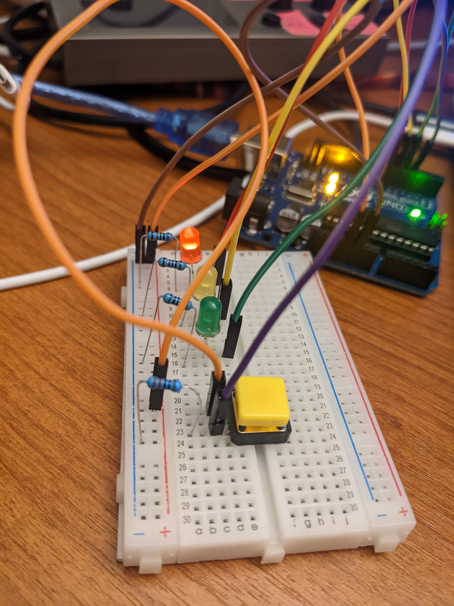

# clase-04

martes 05 abril 2022, presencial

## repaso clase anterior y programa hoy (10 min)

la clase pasada aprendimos:

* electricidad y magnetismo
* componentes eléctricos
* circuitos eléctricos
* instalación de software para el curso

hoy aprenderemos:

* fundamentos de programación en Arduino
* comunicación serial entre Arduino y computador
* programar semáforo en Arduino
* construir circuito para semáforo

## fundamentos de programación en Arduino (90 minutos)

Arduino está basado en Processing, y hereda las 2 funciones principales:

```C++
// setup() ocurre al principio de los tiempos, una vez
void setup() {

  // codigo para configurar condiciones iniciales

}

// loop() ocurre despues de setup(), en bucle
void loop() {

  // codigo para refrescar, leer y escribir informacion

}
```

nuestro Arduino puede almacenar distintos tipos de variables, las que son útiles para distintos propósitos.

en este curso usaremos las siguientes:

```C++

// bool almacena valores verdadero o falso (true, false)
bool verdad = true;

// byte almacena 8 bits, valores enteros entre 0 y 255
byte ochoBits = 255;

// int almacena numeros enteros, tamano 2 bytes = 16 bits
int numeroEntero = -4;

// float almacena numeros con parte decimal
float numeroDecimales = 123.456;

// char almacena un caracter, entre comillas simples ''
char miInicial = 'a';
// tambien puedes escribir directamente el valor decimal
char miInicialDecimal = 141;

// String almacena un arreglo de caracterers, entre comillas dobles ""
String verso = "habia una vez";s

```

### ejemplo con LED interno

código completo en [ej_00_led_interno](ej_00_led_interno)

nuestro Arduino Uno tiene un LED interno conectado internamente al pin 13.

creamos una variable de tipo número entero para almacenar el valor 13.

en la configuración (setup) hacemos que el pin digital 13 sea una salida (OUTPUT).

en el refresco (loop) hacemos que la nuestra salida digital del pin 13 alterne entre valores digitales 1 y 0, con una pausa de 1 segundo entre cada estado.

### ejemplo imprimir String

 código completo en [ej_01_imprimir_string](ej_01_imprimir_string)

nuestro Arduino puede imprimir valores a través del puerto serial.

estos mensajes podemos leerlos en el monitor serial del software Arduino IDE.

en el monitor serial tenemos opciones de configuración de velocidad de [baudios](https://es.wikipedia.org/wiki/Baudio), de avanzar automáticamente, o de registrar el tiempo de llegada de cada mensaje.

### ejemplo imprimir variables internas

código completo en [ej_02_imprimir_variable](ej_02_imprimir_variable)

también podemos imprimir valores de variables internas a través del puerto serial.

### ejemplo arrojar dado

código completo en [ej_03_arrojar_dado](ej_03_arrojar_dado)

podemos programar un Arduino para simular el acto de arrojar un dado, con valores mínino y máximo variables.

### ejemplo lectura serial

código completo en [ej_04_lectura_serial](ej_04_lectura_serial)

este ejemplo nos permite usar el monitor serial para enviar caracteres a Arduino, y que Arduino indique que los recibió.

el número impreso corresponde al valor [ASCII](https://es.wikipedia.org/wiki/ASCII) del caracter enviado.

13 es CR, por carriage return, en español [retorno de carro](https://es.wikipedia.org/wiki/Retorno_de_carro).

### ejemplo poema condicional

código completo en [ej_05_poema_condicional](ej_05_poema_condicional)

este ejemplo permite escribir un poema interactivo en nuestro microcontrolador, que responde a nuestra entrada por puerto serial.

## programar semáforo con Arduino y construir circuito (45 minutos)

código completo en [ej_06_semaforo](ej_06_semaforo)

usar 3 LEDs: rojo, verde, amarillo. conectar sus terminales negativos a tierra a través de una resistencia, y sus terminales positivos a un pin digital de Arduino.

usar un boton, conectar uno de los pines a 5V, y el otro pin a tierra a través de una resistencia. conectar Arduino a este último pin para medirlo.

