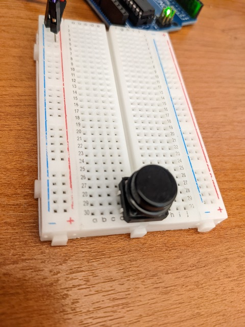
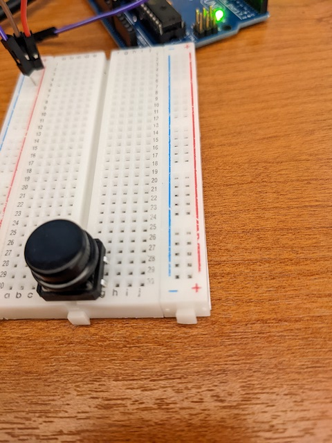
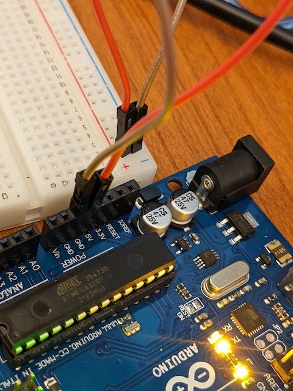
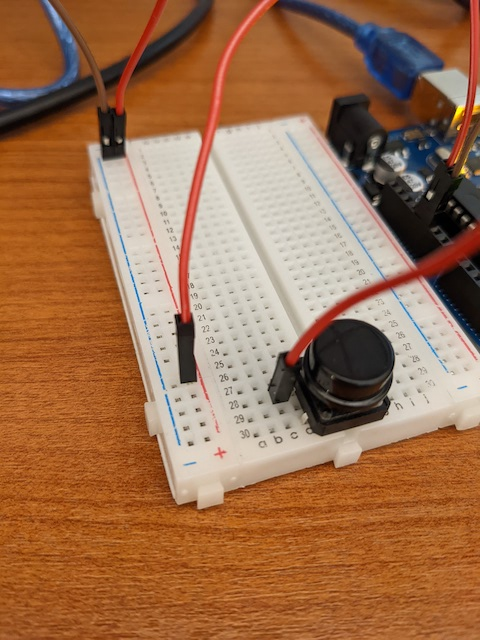
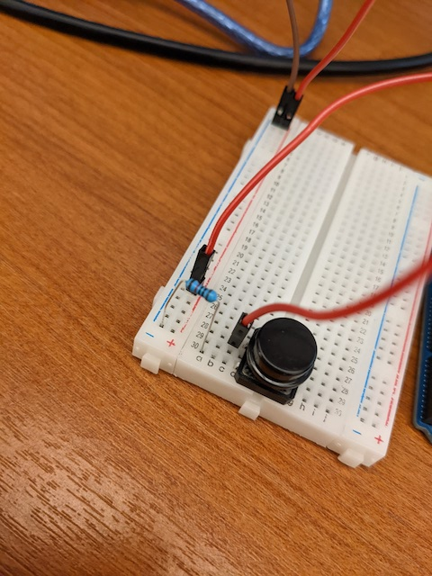
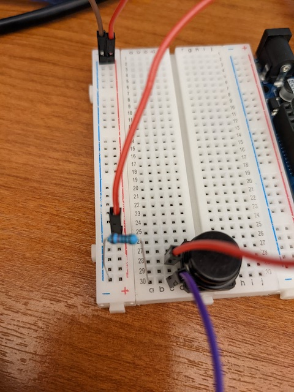
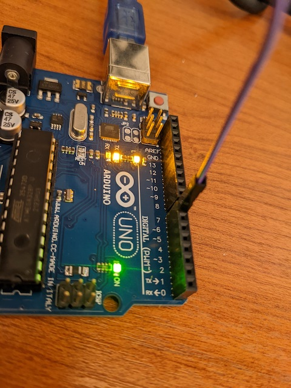
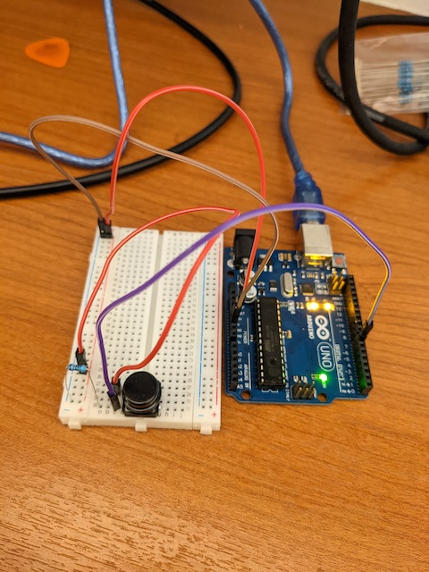

# clase-05

martes 12 abril 2022, presencial

## repaso clase anterior y programa hoy (10 min)

la clase pasada aprendimos:

* fundamentos de programación en Arduino
* comunicación serial entre Arduino y computador
* programar semáforo en Arduino
* construir circuito para semáforo

hoy aprenderemos:

* botón
* potenciómetro
* timing y tap tempo

## repaso botón (60 min)

primero repasamos cómo leer un botón

el botón tiene dos patitas, la de arriba la conectamos a la fuente de poder, la de abajo la conectamos a tierra a través de una resistencia de 10k Ohm.

la entrada digital de Arduino lee el voltaje en la patita de la resistencia que está conectada al botón, no a la resistencia.

explicar ley de ohm, en ambos casos, corriente y voltaje.

explicar normally on, normally closed.

conectar LED y resistencia a salida digital de Arduino para prender y apagar Arduino.

explicar diferentes comportamientos: toggle switch, momentary on, 

ej_00

ej_01_sin_delay

ej_02_potenciometro

ejemplo con Line 6 DL4

aplicar tap tempo a Arduino