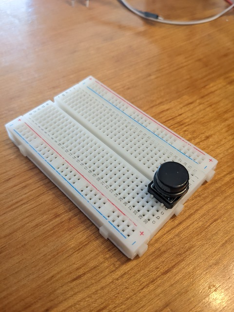
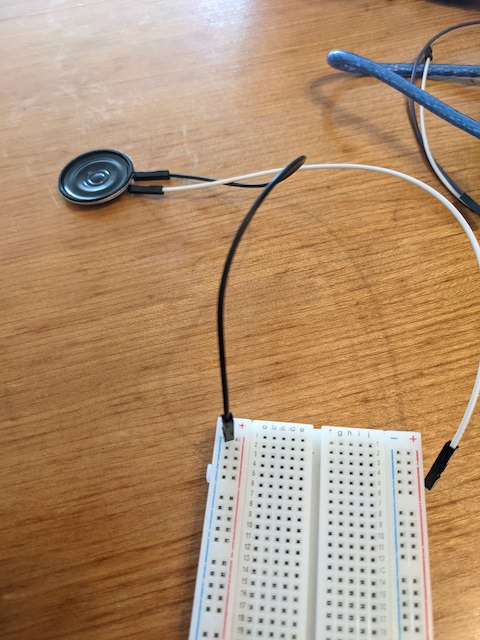
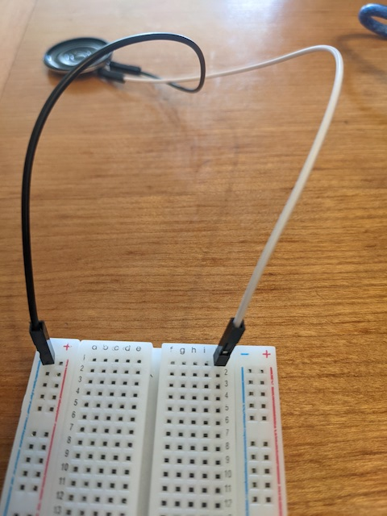
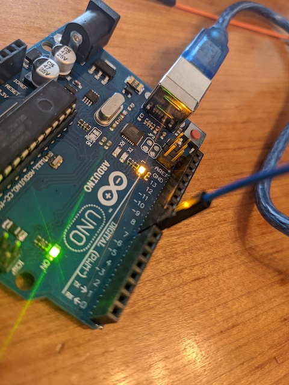
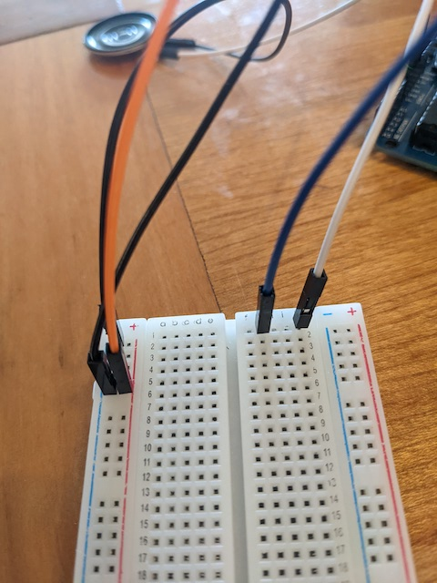
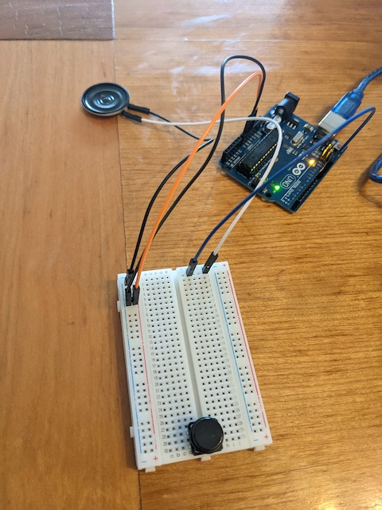
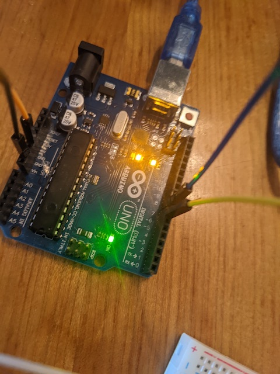

# clase-07

martes 26 abril 2022, presencial

## repaso clase anterior y programa hoy (15 min)

la clase pasada fue cancelada, pero la anterior aprendimos:

* botón pulsador
* delay() y maneras de evitarlo
* potenciómetro
* PWM

hoy aprenderemos:

* sonido
* diseño de sintetizadores
* protocolo MIDI

## sonido (45 min)

el sonido es una perturbación de la presión atmósferica, que nuestros oídos son capaces de escuchar.

usaremos nuestro microcontrolador Arduino para generar voltajes que pueden ser alimentados a un parlante, para así transducir energía eléctrica en mecánica y con esto generar sonido.

en este curso usaremos un parlante pequeño, típico en usos de proyectos de electrónica para principiantes como este [https://www.adafruit.com/product/1891]
(https://www.adafruit.com/product/1891).

en particular, usamos un parlante de 8 Ohm y de 0.25 W de potencia. les soldé cables cables de distintos colores para señalizar los terminales positivos y negativos.

esta es la vista frontal del parlante.

y esta es la vista trasera donde se ven sus especificaciones eléctricas.

para probar el funcionamiento de nuestro parlante, conectaremos el parlante a nuestro Arduino, primero a tierra. 

y después al pin 8 digital, en el lado derecho del Arduino.

para que se vea así.

subimos el código [ej_00_probar_parlante/](./ej_00_probar_parlante/) para probar el funcionamiento. este código solamente emite sonido durante setup(), no en loop().

para poder volver a escuchar el sonido, conectar y desconectar el cable USB, o presionar el botón rojo para reiniciar.

probemos cambiando la frecuencia, encontrar el menor y mayor número de frecuencia que podemos escuchar.

en el ejemplo [ej_01_melodia](./ej_01_melodia/) tenemos una melodía de 8 notas, usaremos 2 arreglos de tipo int y tamaño 8, uno para almacenar las frecuencias y otro para las duraciones.

los arreglos nos permiten almacenar conjuntos de valores relacionados, e iterar a través de ellos fácilmente, usando un bucle for.

## diseño de sintetizadores (45 min)

hasta el momento tenemos un instrumento muy difícil de manejar, que solamente podemos encender y apagar. agreguemos una interfaz electrónica para poder controlar diversos aspectos del sonido.

hoy construiremos nuestro primer sintetizador, que es un instrumento electrónico que permite sintetizar o crear sonidos.

primero traspasemos el circuito con nuestro parlante a nuestra protoboard, para así añadir más componentes.

partamos de nuestra protoboard anterior, con un botón pulsador en el extremo inferior.

conectemos la tierra del parlante a la protoboard.

conectemos la señal del parlante a la fila 1 de la protoboard.

usemos un cable para acceder a los 5v desde nuestro Arduino.

el otro extremo del cable se conecta al riel de alimentación de la protoboard.

usamos otro cable para acceder a tierra en Arduino.

y el otro extremo lo usamos para conectar al riel de tierra de la protoboard.

conectamos otro cable a la señal de salida de audio del Arduino.

conectamos el otro extremo del cable a la fila 1 de la protoboard, para conectar con el parlante.

el circuito del parlante se ve así, y si presionamos el botón rojo podemos escuchar de nuevo la melodía.

usemos ahora el ejemplo [ej_02_sonido_pulsador/](./ej_02_sonido_pulsador/) para lograr que nuestro sonido ocurra solamente mientras tenemos el pulsador presionado, como en un teclado.

conectamos un resistor entre tierra y el terminal inferior del pulsador.

el terminal superior del pulsador lo conectamos al riel de alimentación 5V de la protoboard.

en el mismo terminal donde está el resistor, conectamos un cable para medir el voltaje.

el otro extremo de ese cable lo conectamos al pin digital 7 de nuestro Arduino.

en mi protoboard noté que la tierra no se transmite bien a lo largo del riel, lo que hace que la lectura del pulsador sea ruidosa y no funcione bien, por lo que conecté un cable entre la parte superior del riel y la parte inferior, lo que solucionó el problema.

el ejemplo [ej_03_sonido_pulsador_aleatorio](./ej_03_sonido_pulsador_aleatorio/) detecta cuando el pulsador es presionado y elige una frecuencia aleatoria cada vez. este ejemplo también enseña una manera de cómo usar más variables para almacenar la historia de los estados, y así diferenciar entre los actos de presionar el pulsador, y de mantener presionado el pulsador.

ahora usaremos una perilla para manipular la frecuencia.

## protocolo MIDI (60 min)

el protocolo MIDI fue creado en los 80.

incluir referencia a libro sobre protocolo MIDI y economía y ciencias sociales.

baud rate 115200

mensaje MIDI típico: 3 bytes.

donde 1xxxxxxx 0xxxxxxx 0xxxxxxx

el byte 0 empieza con 1.

los bytes 1 y 2 empiezan con 0

esto sirve para poder saber dónde empiezan y terminan los mensajes

esto hace que a pesar de usar bytes para enviar y recibir mensajes, su resolución es de 7 bits, no 8.

una resolución de 7 bits permite pow(2,7) = 128 valores distintos, resultando en rangos 0-127.

un típico mensaje de nota MIDI está hecho así:

donde 11001cccc 0nnnnnnn 0vvvvvvv

el byte 0 tiene en orden:
1 - por ser primer byte de mensaje MIDI
1001 - para indicar note on message
c = canal (0-15)

los siguientes byte empiezan con 0
n = número de nota (0-127)
v = velocidad o volumen(0-127)