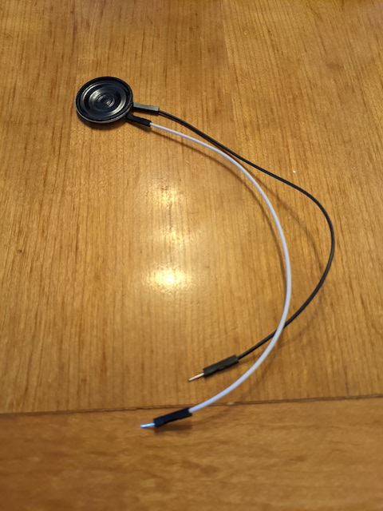
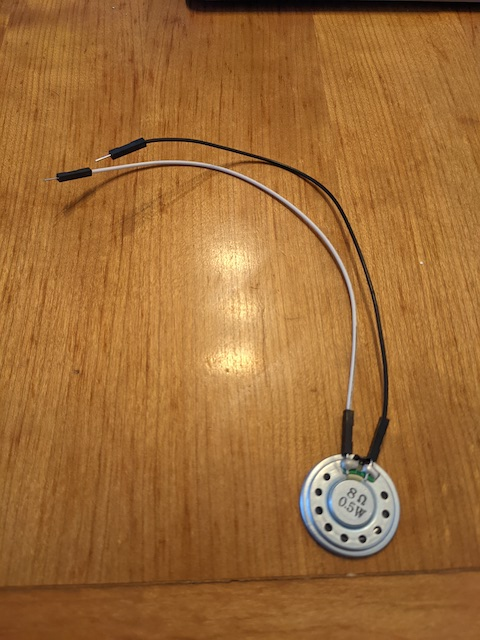
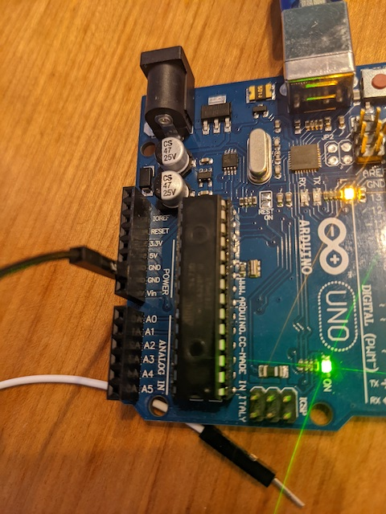
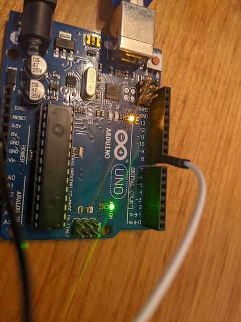
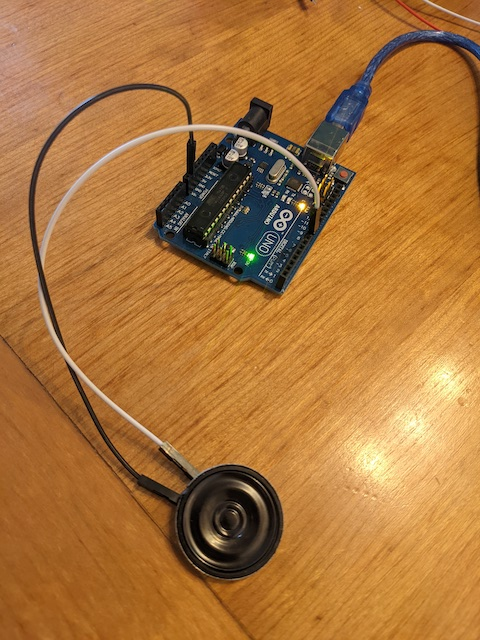

# clase-07

martes 26 abril 2022, presencial

## repaso clase anterior y programa hoy (10 min)

la clase pasada fue cancelada, pero la anterior aprendimos:

* botón pulsador
* delay() y maneras de evitarlo
* potenciómetro
* PWM

hoy aprenderemos:

* sonido
* diseño de sintetizadores
* protocolo MIDI

## sonido (60 min)

el sonido es una perturbación de la presión atmósferica, que nuestros oídos son capaces de escuchar.

usaremos nuestro microcontrolador Arduino para generar voltajes que pueden ser alimentados a un parlante, para así transducir energía eléctrica en mecánica y con esto generar sonido.

en este curso usaremos un parlante pequeño, típico en usos de proyectos de electrónica para principiantes como este [https://www.adafruit.com/product/1891]
(https://www.adafruit.com/product/1891).

en particular, usamos un parlante de 8 Ohm y de 0.25 W de potencia. les soldé cables cables de distintos colores para señalizar los terminales positivos y negativos.

para probar si el parlante está funcionando, usaremos el código 

## diseño de sintetizadores (60 min)

## protocolo MIDI (60 min)

el protocolo MIDI fue creado en los 80.

incluir referencia a libro sobre protocolo MIDI y economía y ciencias sociales.

baud rate 115200

mensaje MIDI típico: 3 bytes.

donde 1xxxxxxx 0xxxxxxx 0xxxxxxx

el byte 0 empieza con 1.

los bytes 1 y 2 empiezan con 0

esto sirve para poder saber dónde empiezan y terminan los mensajes

esto hace que a pesar de usar bytes para enviar y recibir mensajes, su resolución es de 7 bits, no 8.

una resolución de 7 bits permite pow(2,7) = 128 valores distintos, resultando en rangos 0-127.

un típico mensaje de nota MIDI está hecho así:

donde 11001cccc 0nnnnnnn 0vvvvvvv

el byte 0 tiene en orden:
1 - por ser primer byte de mensaje MIDI
1001 - para indicar note on message
c = canal (0-15)

los siguientes byte empiezan con 0
n = número de nota (0-127)
v = velocidad o volumen(0-127)