# clase-08

martes 03 mayo 2022, presencial

## repaso clase anterior y programa hoy (15 min)

la clase pasada aprendimos:

* sonido
* diseño de sintetizadores
* protocolo MIDI

hoy aprenderemos:

* comunicación serial con apps y Processing
* comunicación serial con navegador web y p5.js

## comunicación serial con apps y Processing (60 mins)

gracias a la comunicación serial, podemos crear aplicaciones en Processing que son capaces de recibir información desde nuestro Arduino, y al revés también.

abramos el ejemplo [ej_00_arduino_envia_numeros](./ej_00_arduino_envia_numeros/) y subamos el código al microcontrolador Arduino.

este ejemplo envia por puerto serial una linea, con dos valores separados por coma. el primer valor es aleatorio y el segundo es un contador, que parte en 0 y aumenta en 1 por cada iteración del bucle loop() de Arduino.

podemos abrir el monitor serial del software Arduino IDE y ver los valores para confirmar que está funcionando.

cerramos el monitor serial y luego abrimos el ejemplo de Processing [ej_00_processing_recibe_numeros](./ej_00_processing_recibe_numeros/) que recibe estos números, porque una comunicación serial solamente puede ir desde un lugar a otro, entonces si no cerramos el monitor serial de Arduino, el puerto serial estará ocupado y Processing no podrá acceder a esos valores.

el ejemplo en Processing dibuja una elipse usando los valores recibidos desde Arduino. para lograr hacer la conexión serial entre nuestro hardware microcontrolador Arduino y el software Processing, debemos correr el software en Processing y mirar la consola de Processing e identificar el número de puerto serial ocupado por Arduino, y actualizar ese valor en el código de Processing.

notar que esta configuración puede ser un problema, porque esto hace que nuestro software en Processing no sea "plug and play" o "conectar y listo", debemos configurar esto en cada computador o Arduino que usamos, para asegurar que la conexión serial funcione.

en el siguiente ejemplo, usaremos el mismo circuito con pulsador y potenciómetro de la clase anterior, acá está copiado a continuación.

partamos de nuestra protoboard anterior, con un botón pulsador en el extremo inferior.

usemos un cable para acceder a los 5v desde nuestro Arduino.

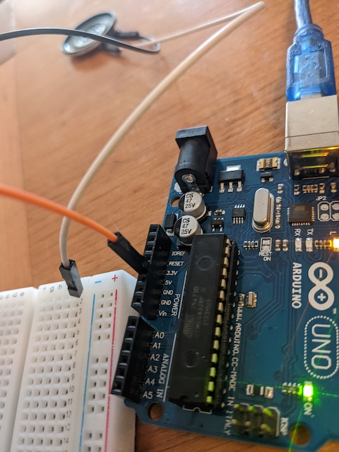

el otro extremo del cable se conecta al riel de alimentación de la protoboard.

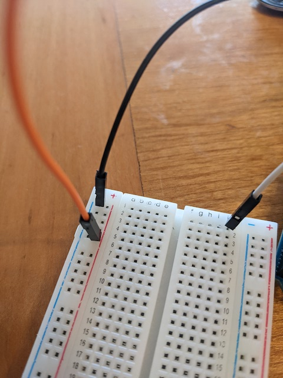

usamos otro cable para acceder a tierra en Arduino.

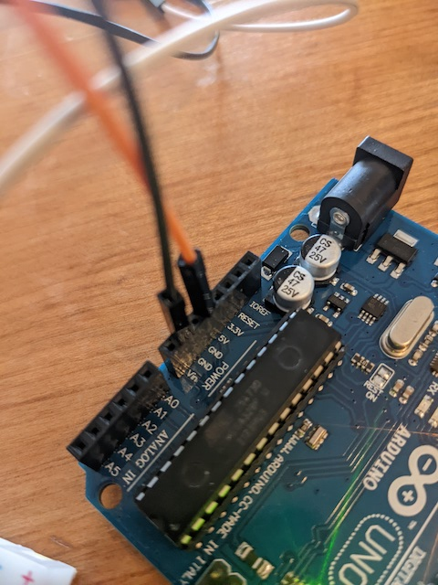

y el otro extremo lo usamos para conectar al riel de tierra de la protoboard.

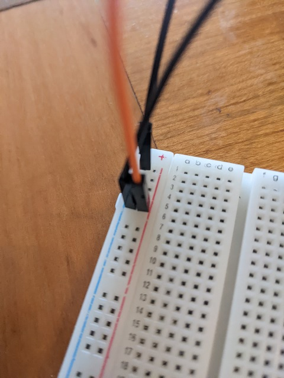

conectamos un resistor entre tierra y el terminal inferior del pulsador.

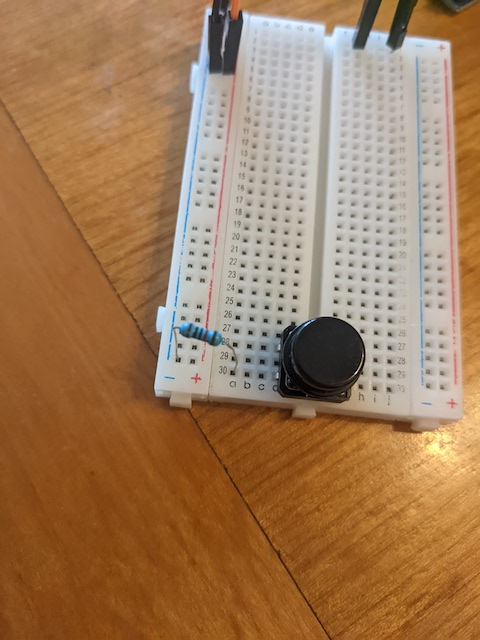

el terminal superior del pulsador lo conectamos al riel de alimentación 5V de la protoboard.

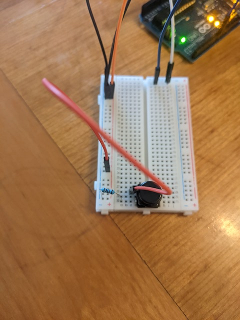

en el mismo terminal donde está el resistor, conectamos un cable para medir el voltaje.

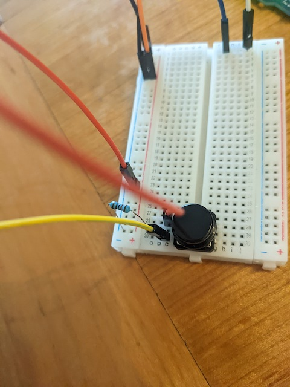

el otro extremo de ese cable lo conectamos al pin digital 7 de nuestro Arduino.

en mi protoboard noté que la tierra no se transmite bien a lo largo del riel, lo que hace que la lectura del pulsador sea ruidosa y no funcione bien, por lo que conecté un cable entre la parte superior del riel y la parte inferior, lo que solucionó el problema.

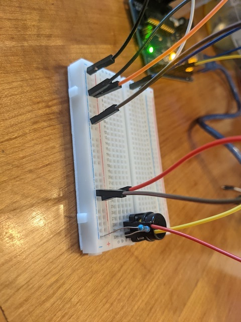

ahora conectaremos un potenciómetro de una sola vuelta.

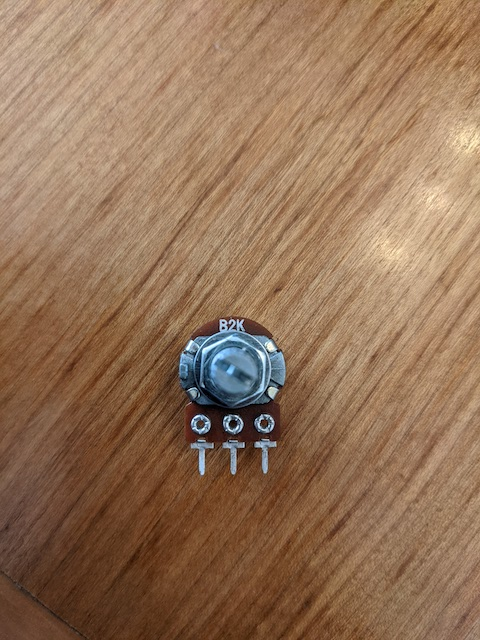

lo conectamos en la columna a de la protoboard, con el terminal izquierdo en la fila 10, el central en la 12, y el derecho en la 14.

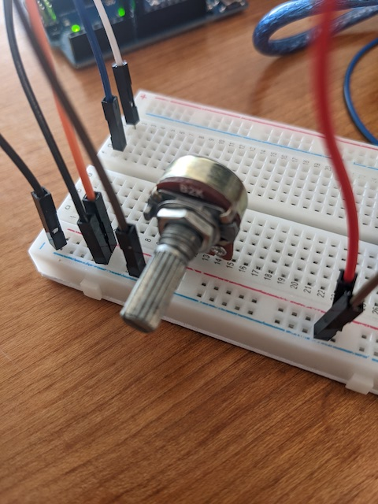

así se ve atrás donde realizaremos las conexiones.

el terminal derecho en la fila 14 lo conectamos a 5V con un cable.

el terminal izquierdo en la fila 10 lo conectamos a tierra con un cable.

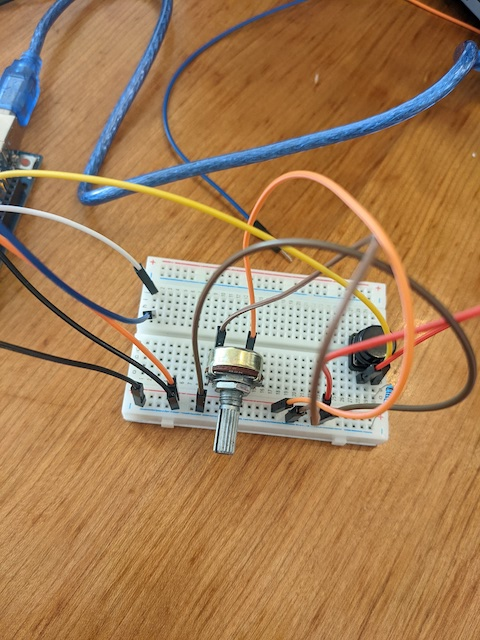

conectamos un cable al terminal central en la fila 12 para su lectura análoga.

el otro extremo del cable de señal lo conectamos al pin A0 de entrada analógica del Arduino.

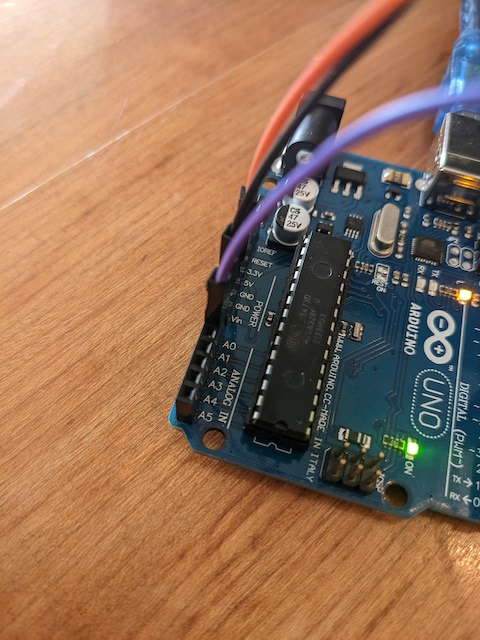

## motivación de comunicación serial con Processing (30 min)

nuestro computador tiene distintas maneras de ingresar información, como ratón, teclado y cámara.

la gran gracia de nuestro microcontrolador Arduino es que tiene pines GPIO (general purpose input and output, en español pines de propósito general para entrada y salida).

un teclado de computador tiene muchas teclas que pueden detectar cuando son presionadas, y cada tecla envía una señal que distingue la tecla que fue presionada y en qué momento, lo que permite teclear sucesiones de caracteres en orden y rápidamente.

el ratón o trackpad permite mover el cursor en la pantalla en coordenadas X e Y. con los botones se pueden hacer acciones distintas, incluyendo click con botón izquierdo, central o derecho, doble click al pulsar el mismo botón dos veces consecutivas y rápido.

estos avances permitieron que los computadores pasaran de ser dispositivos controlados exclusivamente por comandos textuales, a lo que conocemos como [GUI](https://es.wikipedia.org/wiki/Interfaz_gr%C3%A1fica_de_usuario) (graphical user interface, interfaz gráfica de usuario).

enlaces de interés:

* Xerox Parc
* Grupo de investigación Tangible Media, liderado por profesor Hiroshi Ishii

## comunicación serial con navegador web y p5.js (60 mins)

para usar comunicación serial con el navegador, necesitamos usar

## motivación proyecto mitad de semestre próxima semana (45 min)

la próxima semana haremos nuestro proyecto de mitad de semestre.

trabajen en grupos de 2 o 3 personas.

requisitos:

* deben enviarme un mail con los nombres de su grupo y el link de su repositorio
* el proyecto debe usar un microcontrolador Arduino
* deben crear un repositorio de GitHub
* el código de su Arduino debe estar en el repositorio
* deben agregar crédito sobre citas y referencias de código
* el archivo README.md del repositorio debe tener texto con influencias, instrucciones, resultados finales y aprendizajes

inspiración:

* [nicole he - grow slow](https://github.com/nicolehe/grow_slow)